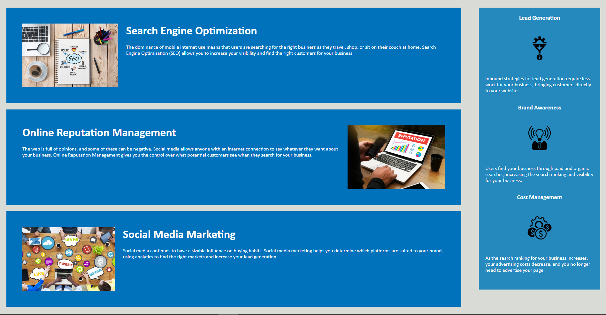

# Code Refactor Starter Code

Webpage for Horiseon Social Services. It includes some changes to make html and css code more readable and accessible. Also fixed any broken links in the html and made classes more generic where possible. These more generic classes were used to significantly shorten css style sheet.
  
Link: tzeuch0922.github.io/Horiseon-SEO/